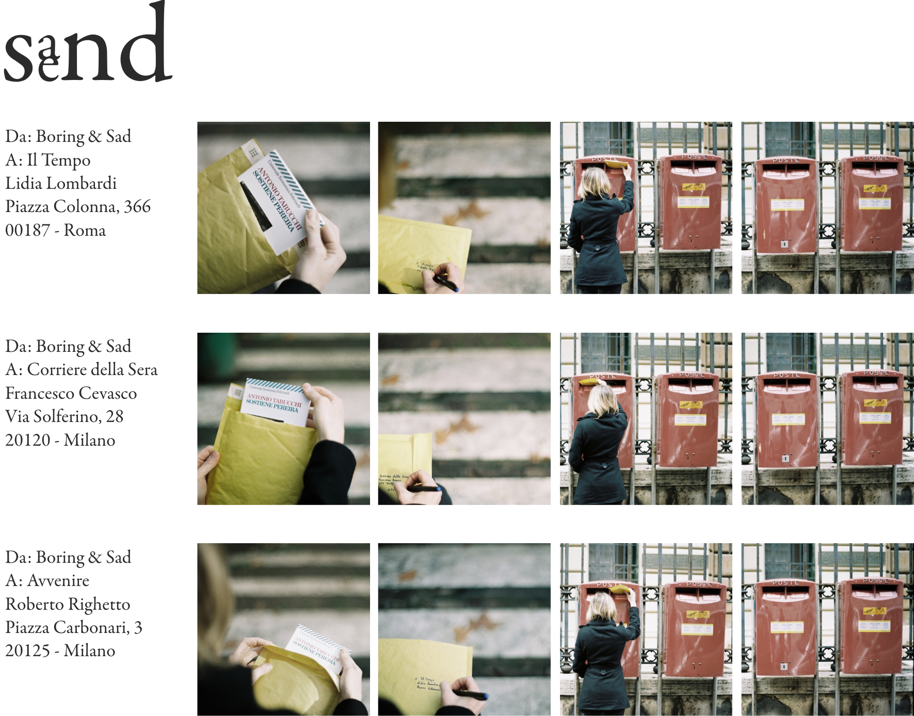

Sa-end è  un lavoro politico, da qui il sapore anni settanta. La performance consiste nella spedizione del testo di Antonio Tabucchi “Sostiene Pereira” a tre responsabili della pagina culturale di tre testate giornalistiche diverse. Un responsabile della pagina culturale, infatti, è il protagonista della storia di Tabucchi; un giornalista un po’ distratto, un po’ miope; talmente chiuso nel suo privato da aver perso di vista il compito sociale del suo lavoro, da non essersi accorto della dittatura imminente.
Il giornalismo contemporaneo appare sempre più
disattento, banalizzante e pettegolo. Interessato più alla descrizione minuziosa di fatterelli che all'analisi di fenomeni complessi.
La performance è stata intitolata sa-end per un presagio che purtroppo si è rivelato veritiero; è stata infatti una spedizione sabbiosa e insabbiata: nessuno ci ha ringraziati, anche se il nostro indirizzo era presente sulla busta.

