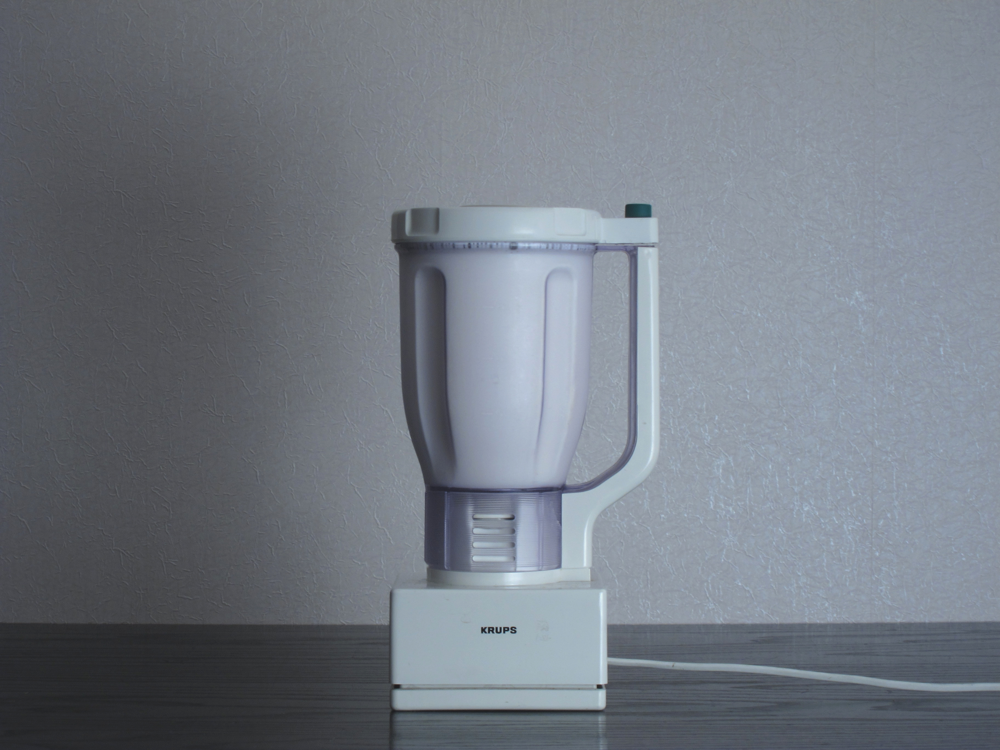

[Devourer](https://vimeo.com/48023897)

Devourer è strettamente legato al libro di racconti “Privato”, infatti è stato proiettato per la prima volta nella libreria Altroquando, in occasione della presentazione romana del libro. Il video è stato consegnato a evento iniziato; scorreva in loop alle spalle dei relatori, creando un equilibrio democratico: da una parte il pubblico che vedeva il video ma non aveva letto il testo, dall'altra i presentatori che avevano letto il libro, ma non avevano visto il video.
Di "Privato" condivide la tematica di fondo: la relazione fra genitori e figli, fra colui che crea e ciò che è creato. “Devourer” è un tentativo di far sentire ciò che in “Privato” è argomentato. Ha l’obiettivo di parlare allo stomaco.
"Devourer" è Crono, il dio che sbrana i suoi stessi figli per ansia di esistere, per non correre il pericolo di essere spodestato. Il Crono contemporaneo cerca, invece, di bloccare il tempo, non permettendo ai figli di crescere, non consentirà a se stesso di invecchiare. Crono è il genitore che non abdica e che per non abdicare è disposto a uccidere con un metodo subdolo: inglobando. Attraverso "Devourer" volevamo affrontare due tematiche interconnesse: il rapporto genitori-figli, artista-opera.
L’autore è Crono nel momento in cui è vinto dal culto di sé, nel momento in cui, troppo impegnato alla costruzione della propria immagine, si dimentica dell’opera. E l’opera si riduce a un veicolo per ingigantire l’immagine di sé. Una sorta di perversione dell’oggetto in cui il fine non è più fare un’opera valida, ma accrescere il proprio nome.

