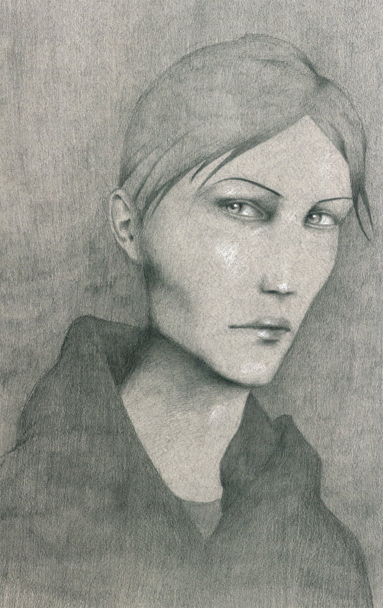

Originalmente uscito su [Scrittori Precari](https://scrittoriprecari.wordpress.com/2014/01/10/il-ragazzo-e-il-cane/).

_"Il cane era grigio e magro, alto, un alano di taglia grande, quasi un cavallo; le palle gli scendevano fra le zampe posteriori, erano un sacchetto enorme. Il cane era un cane. Anche il ragazzo era magro e alto, con i capelli castani e radi, senza taglio, quasi buttati sulla testa.
Il cane grande era sempre solo, aveva anche vissuto in branco ma non era riuscito a diventare il capo e allora lo aveva disertato. Anche il ragazzo era sempre solo, era stato stanco dei capi, dei nascondini e degli acchiapparelli, delle finzioni e dei giochi.
Tutte le mattine il ragazzo percorreva un unico tratto di strada: il tratto dal suo portone al bidone dell’immondizia; due volte una per andare e una per tornare. Camminava velocemente con la testa parallela all’asfalto.
Una mattina però il cane lo vide da lontano e annusò la sua paura. Gli corse incontro e abbaiò. Il ragazzo raggelò, la pelle del volto bianco-giallastra. Rimase immobile. Il cane si fece sotto, digrignò i denti, il ragazzo immobile, guardava il cane, poi fissava il vuoto, poi di nuovo il cane, con movimenti oculari quasi impercettibili, immobile. Il cane cacciò la sua lingua molle e pesante e gli leccò la mano. Il ragazzo ebbe un conato di vomito ma lo lasciò fare. Il cane gli leccò anche l’altra mano e poi prese l’intera mano nella bocca, il ragazzo sentiva l’umido e il fiato caldo del cane sul polso, rimase immobile, lo stomaco rivoltato, il vomito nell’esofago.
Con la stessa inaspettata foga con cui era arrivato, il cane se ne andò. E il ragazzo rientrò nella sua casa vacillando. Il giorno dopo il ragazzo uscì per percorrere il solito tratto e il cane lo aspettava festoso, si avvicinò.
Quando il ragazzo gli sparò, scodinzolava.
La signora che di sfuggita colse la scena dalla finestra poi disse, anche, che il ragazzo era un cane."_

*Illustrazioni di Ivano Talamo*

Un testo si presta a molte interpretazioni, ogni lettore ci troverà qualcosa di diverso. Se chi lo scrive, però, vuole dire una cosa e una sola questo causa molta frustrazione. La libera interpretazione per alcuni autori può essere un vantaggio, per altri una disgrazia. Sicuramente la lingua è di per sé un sistema ambiguo, d'altra parte il lettore spesso ha ansia di trovare se stesso nel testo e sovra interpreta quello che legge influenzato dal proprio schema valoriale.
Invito chi legge il racconto a inviarmi un file mp3 in cui risponde a questa domanda: Perché il ragazzo uccide il cane?

[Interpretazione Rossella ▶](https://files.fm/f/eehvf2wd4)

[Interpretazione Pasquale ▶](https://files.fm/f/kf3uaq7f6)

[Interpretazione ? ▶](https://files.fm/f/9cbcbbdss)

[Interpretazione Aldo ▶](https://files.fm/f/cfx8f85eq)

[Interpretazione Donatello ▶](https://files.fm/f/gg9549ncy)

[Interpretazione Donato ▶](https://files.fm/f/ec4yb6tmu)

[Interpretazione Federico ▶](https://files.fm/f/ty5gqfgex)

[Interpretazione Luca ▶](https://files.fm/f/u3f5mqx7p)

[Interpretazione Nicola ▶](https://files.fm/f/86ukg557v)
