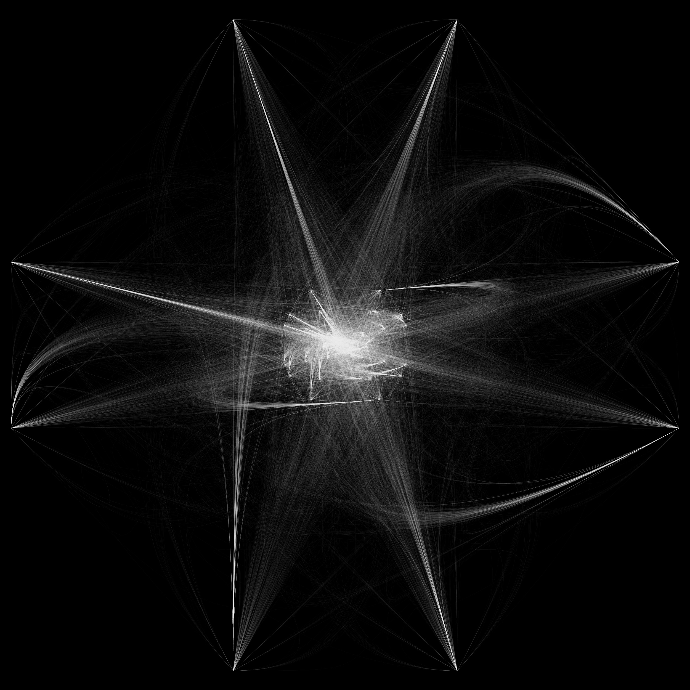
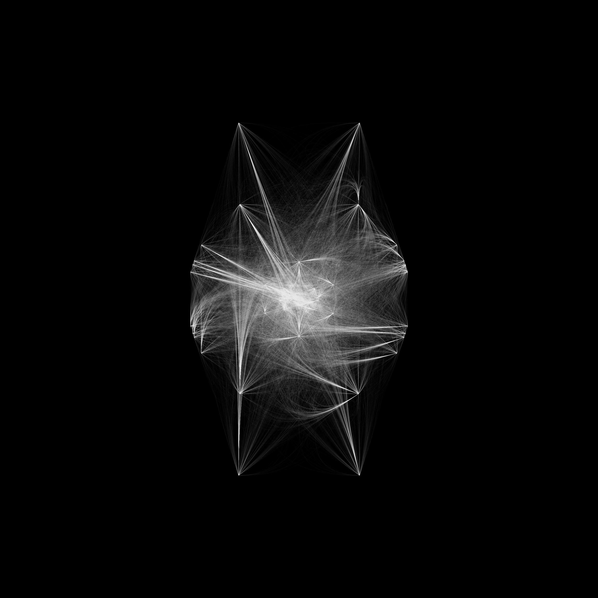
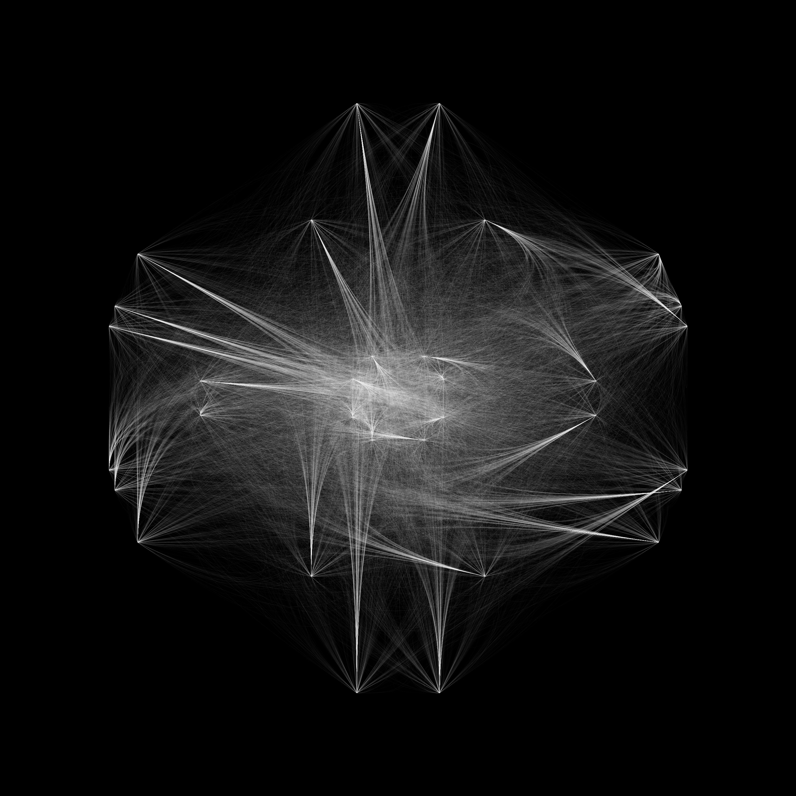

Durante la mia infanzia il lavoro di mio nonno paterno, che non ho mai conosciuto, costituiva un tabù.
Mio nonno era un falegname e costruiva bare.
Quando io ero bambina l’attività di mio nonno era già chiusa e a testimonianza di essa erano rimaste poche foto, un documento, tanti ricordi e un vano (puteca) di 20 metri quadri in un vicolo di Portici.
I racconti sulla bottega erano e sono confusi e contraddittori.
La confusione più grande riguarda il motivo e la data della chiusura dell’attività di mio nonno, ma all’unanimità tutti hanno sempre sostenuto che le cause principali siano state le problematiche con la delinquenza organizzata.
Cobwebs è la fotografia di questi racconti, riportati da tre testimoni, e la trasformazione dei racconti in immagini per dare a colpo d’occhio l’idea della diversità dei ricordi.
È un’indagine sulla memoria come facoltà cognitiva e apre quindi una riflessione sulla possibilità o meno di ricostruire un fatto affidandosi semplicemente alla stessa.
Al contempo apre una finestra sulla distorsione inconsapevole operata dalla memoria, sul bisogno di salvare se stessi e di inquadrare i fatti in modo che siano coerenti con il sistema valoriale che ci appartiene. Il metodo che abbiamo scelto per affrontare questa indagine è stato l’intervista e abbiamo così dato inizio a un esperimento facendoci raccontare uno stesso fatto da diversi testimoni.

# Descrizione tecnica

Il lavoro si compone di tre video e tre immagini montate in serie su lightbox.
La traccia audio di ogni video è l'intervista di un testimone.
La parte visiva rappresenta un'immagine che si compone progressivamente
e che altro non è che l'immagine del fatto realizzata via software.
Il software genera l'immagine guardando due tipi di dati dalle storie: gli eventi principali, che sono mappati su un numero casuale univoco; l'anno in cui si sono verificati. Ciascuna di questa coppia di valori è un punto, posizionato sul piano visivo utilizzando il sistema di coordinate polari e viene specchiato nei suoi quattro quadranti.
Tutti i punti sono collegati da curve che creano una sorta di ragnatela che fornisce una rappresentazione unica di ogni racconto.

*Maria*
[maria video](https://vimeo.com/484158130)

I video Ciro e Vincenzo non sono disponibili su questo sito.

*Ciro*

*Vincenzo*
