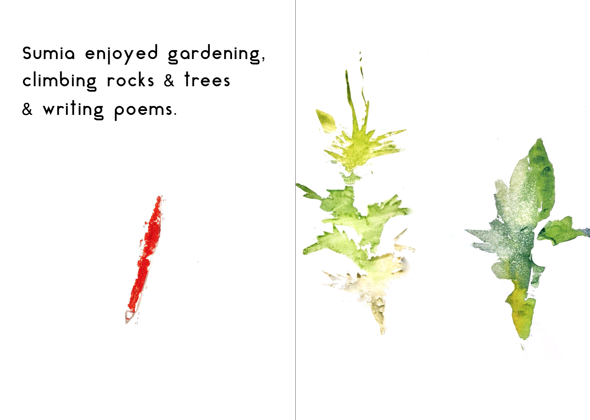
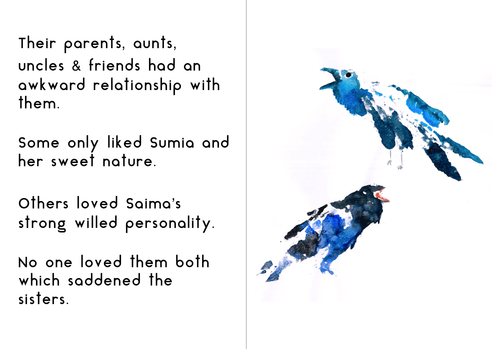

Gli acquerelli accompagnati da una breve storia sono nati in seno a un progetto portato avanti dall'artista pakistana Nilofar Akmut in collaborazione con Womanifesto. Diversi artisti provenienti da tutto il mondo sono stati invitati a comporre un racconto illustrato da inviare all'associazione Camel Library, che si occupa di rifornire di libri i bambini che abitano nei villaggi rurali  del Pakistan.
Il mio racconto nasce da acquerelli semplici che raccontano una storia banale, sincera e difficile.

Sinossi:
I confronti e le competizioni mettono sotto pressione l'amore, facendoci sentire costantemente sotto una gara. Le relazioni, però, devono imparare a essere più forti di qualsiasi veleno. Niente è più importante di trovare persone da amare e della sensazione di  sentirsi amati.

Il progetto è stato presentato da Nilofar Akmut con il patrocinio del British Council e del The Prince's Trust di Londra.
